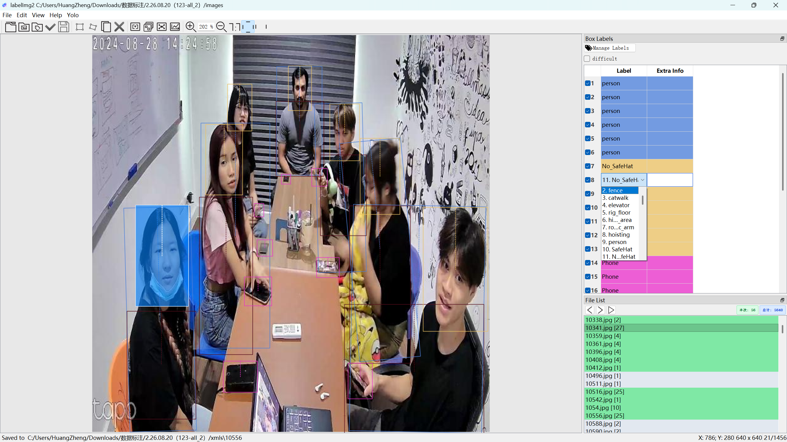

<div align="center">


# LabelImg2

### 新一代深度学习目标检测标注与模型自训练一体化工作台
**支持常规水平矩形框（Horizontal Box）与任意角度旋转框（OBB）的高性能计算机视觉标注套件**

[](https://github.com/ByteFlow-art/labelImg2/releases)
[](https://www.python.org/)
[](https://riverbankcomputing.com/software/pyqt/)
[](https://pytorch.org/)
[](https://github.com/ultralytics/ultralytics)
[]()
[](LICENSE)

[版本发布](#1-版本发布与更新日志) | [安装指南](#2-软件安装与快速启动) | [架构对比](#4-对标-chinakooklabelimg2-核心特性升级对比) | [功能详解](#5-核心功能深度解析) | [作业流程](#6-标准标注作业流程) | [快捷键表](#7-常用快捷键速查表) | [数据格式](#8-支持的标注数据格式)

<br>



</div>

---

## 1. 版本发布与更新日志

### v1.0.0 正式发布版 (Current Stable Release)
- **版本号**：`v1.0.0`
- **发布日期**：2026-08-19
- **运行环境**：Windows 10 / Windows 11 (x64)，支持 NVIDIA GPU CUDA 加速及 CPU 运行
- **一键高速下载**：
  - **Windows 独立图形化安装向导**：[`LabelImg2_Setup_v1.0.0.exe`](https://github.com/ByteFlow-art/labelImg2/releases/download/v1.0.0/LabelImg2_Setup_v1.0.0.exe)（推荐，一键部署环境、桌面快捷方式与一键卸载向导）
  - **完整源码包**：[`Source code (zip)`](https://github.com/ByteFlow-art/labelImg2/archive/refs/tags/v1.0.0.zip)

#### v1.0.0 核心功能升级与优化点
1. **内置 YOLO AI 智能模型中心**：深度集成 YOLOv8 / YOLOv11 / 自定义模型推理，支持单图秒级预测与全目录多线程后台批量自动批注，画布与标签列表实时双向无缝同步。
2. **双模式自动标注自由切换**：支持“完全覆盖替换模式”与“追加合并模式”（基于 IoU > 0.85 自动去重，完整保留已有手工标注框并追加新目标）。
3. **免代码闭环模型自训练控制台**：一键自动划分训练/验证集，自适应超参数配置，流式实时监控 Loss / mAP50 / mAP50-95 曲线并支持训练权重一键导出回载应用。
4. **OBB 旋转框长按动态变速加速旋转**：短按 1.0° 像素级微调，长按平滑加速至 1.5°（2秒达峰值速率），松开瞬时平稳复位，兼顾极致微调与大幅疾旋。
5. **OBB 主副轴尺寸独立微调**：支持 `X` 键主轴长度微调、`C` 键副轴宽度微调，尺寸调节绝不产生任何角度畸变。
6. **面积自适应重叠层级管理**：大框自动置底、小框优先置顶，点击拾取与边界判断精准分层，彻底消除密集重叠目标选错与中心红点漂移。
7. **智能多图撤销机制 (`Ctrl+Z`)**：单图内部精准按步回退新建、删除、旋转、移动、模型标注等操作；当前图片无操作时自动返回上一张图片并回退其最后操作。
8. **标签选择栏完整预设与自学习**：自动载入全部 61 项工业/通用预置类别，支持标注过程中新增自定义类别的自动记忆与下拉自动补全。
9. **0 毫秒极速正负数字统计系统**：内存级维护标注计数缓存，支持正负净增量（`+N` / `-N`）与负数警示红框，切图快翻极致丝滑，计数稳定不跳动。
10. **图片排序与 Windows 资源管理器实时动态同步**：毫秒级捕获系统资源管理器当前文件夹的视觉排序规则（按名称自然增/倒序、按修改日期最新/最旧、按大小/类型等），外部文件夹排序更改即刻实时重排。
11. **负样本 0 目标安全持久化**：空图片保存时自动弹出负样本确认提示，生成标准化 0-object XML 标签文件，保障负样本训练合规。
12. **控件防误触锁定机制**：下拉选择框与微调数值框未展开时禁用滚轮滚动，防止滑动浏览界面时改乱模型超参数。
13. **独立路径解耦与状态记忆**：图片输入目录与标签输出目录完全解耦并持久化记忆，每次启动自动恢复上次真实路径与窗口状态。
14. **交互式一键卸载向导**：支持“彻底删除所有文件”与“保留隔离环境卸载”双模式，彻底释放空间或保留环境随心选择。
15. **双轨极速分发与全自动环境初始化**：提供独立图形化安装程序（.exe）与一键自动启动脚本（.bat），首次启动全自动部署 Python/Conda 隔离环境。

*(后续版本发布将按时间线在下方依次追加更新日志与升级特性)*

---

## 2. 软件安装与快速启动

### 2.1 途径一：独立安装程序 (.exe) [推荐普通用户]
适合无需配置 Python 开发环境的普通用户与标注人员：
1. 前往本项目的 [GitHub Releases 页面](https://github.com/ByteFlow-art/labelImg2/releases)；
2. 下载最新版独立安装程序 `LabelImg2_Setup_v1.0.0.exe`；
3. 运行进入图形化安装向导，按照提示选择安装路径并勾选创建桌面快捷方式与环境自动部署；
4. 安装完成后勾选“立即运行”即可直接进入工作台，亦可随时通过桌面的 **LabelImg2** 专属高清图标启动。

### 2.2 途径二：源码便携运行与启动脚本 (.bat) [推荐开发者]
适合需要便携式运行或进行二次开发的科研与工程人员：
1. 克隆或直接下载源码压缩包并解压：
   ```bash
   git clone https://github.com/ByteFlow-art/labelImg2.git
   cd labelImg2
   ```
2. **一键极速启动**：在项目根目录下，直接双击 **`Start_LabelImg2.bat`**，启动脚本将自动检测依赖环境（首次运行全自动完成环境配置）并秒级拉起工作台；
3. **生成桌面图标**：双击运行 `Create_Desktop_Shortcut.bat`，即可一键在当前 Windows 桌面上创建带专属应用图标的启动快捷方式。

### 2.3 途径三：手动命令行环境搭建 (Conda / UV / Pip)

```bash
# 1. 创建并激活 Python 虚拟环境 (推荐 Python 3.8 ~ 3.11)
conda create -n labelimg2 python=3.10 -y
conda activate labelimg2

# 2. 安装核心依赖 (使用国内清华源极速下载)
pip install -r requirements.txt -i https://pypi.tuna.tsinghua.edu.cn/simple

# 3. 启动 LabelImg2 工作台
python labelImg.py
```

---

## 3. 项目简介与核心定位

**LabelImg2** 是一款面向计算机视觉深度学习目标检测的高性能图形化标注与模型自训练工作台。

传统目标检测标注工具（如原版 `labelImg` 或早期扩展版本）普遍存在“纯手工画框低效”、“标注软件与深度学习算法脱节”、“多框重叠交互冲突”、“切图卡顿与状态丢失”等核心痛点。

本项目在汲取开源社区优秀经验的基础上，进行了全方位的现代化重构与架构升级。不仅完整保留了 Pascal VOC XML 与 YOLO 格式的水平矩形框（Horizontal Box）与任意角度旋转框（Oriented Bounding Box, OBB）标注能力，更深度集成了 **YOLO 智能模型推理中心**、**单图/批量自动批注引擎**、**闭环模型自训练与流式监控**、**系统文件夹排序实时同步** 以及 **0 毫秒极速正负数字统计系统**，为计算机视觉任务、遥感航拍目标检测、工业缺陷质检等场景提供了工业级的生产力加速工作流。

---

## 4. 对标 `chinakook/labelImg2` 核心特性升级对比

| 功能维度 | 基线 `chinakook/labelImg2` / 经典 `labelImg` | LabelImg2 (v1.0.0 正式稳定版) |
| :--- | :--- | :--- |
| **AI 模型自动批注** | 不支持（完全依赖人工纯手工绘制每个标注框） | **内置 YOLO 智能模型中心**：支持 YOLOv8/v11 及自定义模型单图秒级推断与全文件夹多线程后台批量自动批注，画布与标注列表实时无缝同步。 |
| **标注应用模式** | 仅支持单向覆盖写入已有的标注文件 | **双模式自由切换**：支持“完全覆盖替换模式”与“追加合并模式”（基于 IoU > 0.85 智能去重，完好保留原图已有手工标注并追加新目标）。 |
| **模型闭环自训练** | 不支持（需手动切分数据、编写外部脚本训练） | **内置免代码自训练控制台**：一键自动划分训练/验证集，可视化流式监控 Loss / mAP 曲线，训练完毕即刻导出回载应用。 |
| **OBB 旋转框调节** | 固定角度步长微调，长按操作繁琐易手酸 | **长按动态变速加速旋转**：短按 1.0° 像素级精调，长按平滑加速至 1.5°（2秒达峰值速率），松开瞬时平稳复位，兼顾精准度与疾旋。 |
| **OBB 尺寸独立控制** | 仅能整体拖角缩放，拉伸时易改变角度畸变 | **主副轴长度独立缩放**：`X` 键沿主轴方向微调长度，`C` 键沿副轴方向微调宽度，尺寸微调绝不产生任何角度畸变。 |
| **重叠目标层级渲染** | 大小框重合时底层大框挡住小框无法选取 | **面积自适应层级排序**：大框自动置底、小框优先置顶，点击拾取与边界判断精准分层，彻底消除多框重合点击误选与红点漂移。 |
| **撤销与回退机制** | 仅支持单图简单撤销，切图易发生混乱 | **智能多图撤销系统 (`Ctrl+Z`)**：单图细粒度步进撤销；当前图无操作时自动返回上一张图片并回退其最后操作。 |
| **标签选择栏与管理** | 预置类别易丢失，新增类别无法有效记忆 | **完整 61 项预设与自学习机制**：自动载入工业/通用 61 种预设类别，新增自定义类别自动持久化记忆并支持下拉自动补全。 |
| **标注数字统计与展示** | 无统计或切图时阻塞磁盘 I/O 导致卡顿 | **0 毫秒极速正负数字统计**：内存级实时统计净增量（`+N` / `-N`），负数自动警示红框，切图快翻极致丝滑，计数稳定不跳动。 |
| **文件夹图片排序** | 简单字典序排列，与操作系统排序脱节 | **Windows 资源管理器实时同步**：毫秒级感知所选文件夹的系统排序规则（按名称自然增/倒序、按修改日期、大小等），文件夹排序更改即刻实时重排。 |
| **负样本 (0目标) 保存** | 易丢失空标签文件或误抛出异常 | **标准化空标签持久化**：空图片保存时自动弹出负样本确认提示，生成标准化 0-object XML 标签文件，完美适配负样本训练。 |
| **会话修改状态追踪** | 列表颜色状态易在刷新重载后丢失 | **永久荧光绿会话标识**：本次运行期间新建、修改或保存的文件始终保持荧光绿高亮，存量标注文件浅灰区分，未标注透明呈现。 |
| **参数误触防篡改保护** | 鼠标滚轮滑动查看界面时易误改模型参数 | **控件防误触锁定机制**：下拉选择框与微调数值框未展开时自动禁用滚轮切换，防止滑动浏览界面时把模型参数改乱。 |
| **路径记忆与解耦** | 打开图片目录与保存目录易相互串扰覆盖 | **独立路径记忆机制**：图片目录与标签保存目录完全解耦并独立持久化存储，每次启动自动恢复上次真实工作路径与状态。 |
| **一键卸载交互向导** | 需手动逐个删除文件，虚拟环境残留不易清理 | **交互式一键卸载向导**：支持“彻底删除所有文件”与“保留隔离环境卸载”双模式，彻底释放空间或保留环境随心选择。 |
| **软件分发与启动体验** | 仅支持命令行手动配置环境启动 | **企业级双轨分发体系**：提供一键安装向导程序（.exe）与一键自动启动脚本（.bat），首次启动全自动配置环境，开箱即用。 |

---

## 5. 核心功能深度解析

### 5.1 YOLO AI 模型中心与推理引擎
- **全系列模型无缝兼容**：原生支持 Ultralytics YOLOv8、YOLOv11 及自定义 YOLO 系列权重（`.pt`、`.onnx`、`.engine`）。
- **硬件环境自适应检测**：自动识别 NVIDIA CUDA GPU 硬件加速并智能回退至 CPU 推理模式。
- **高精度阈值动态调节**：提供置信度阈值（Confidence）与非极大值抑制（NMS IoU）实时微调滑动条。
- **类别过滤与标签映射**：支持勾选启用指定检测类别，并在保存前直接对目标标签进行重命名映射。
- **相互独立的路径记忆机制**：图片目录与标签保存目录完全解耦并独立持久化存储，每次启动自动恢复上次真实工作路径。

### 5.2 双模式自动批注系统
- **完全覆盖模式 (Full Overwrite)**：清空当前图片旧标签，完全采用模型最新预测结果进行覆盖保存。
- **追加合并模式 (Append & Merge)**：完好保留原图已存在的手动标注（含旋转框角度、属性、颜色等），自动追加模型新检测出的目标，并通过 0.85 IoU 阈值智能过滤重复框。
- **全数据集后台批量处理**：支持对整个文件夹进行多线程并发批注，进度条与日志终端实时可见，处理完成后可在工作台即刻审查微调。

### 5.3 零代码模型闭环自训练控制台
- **免代码一键数据集构建**：指定图像与标签路径，系统全自动完成训练集与验证集的比例划分并生成数据配置文件。
- **丰富超参数自由配置**：支持预训练模型选择、迭代轮次（Epochs）、批次大小（Batch Size）、输入分辨率（640~1280）等调节。
- **流式实时监控看板**：实时流式可视化呈现 Epoch 轮次、Batch 进度、Box Loss、Class Loss、mAP50 及 mAP50-95，训练完成后一键应用至自动标注引擎。

### 5.4 OBB 任意角度旋转框与精准尺寸控制
- **动态变速旋转 (`Z` / `V`)**：短按单步 1.0° 像素级精调，长按平滑加速至 1.5° 实现大角度极速旋转。
- **独立主副轴微调 (`X` / `C`)**：支持沿主轴增加长度（`X`）与沿副轴增加宽度（`C`），大幅提升密集旋转目标框定效率。
- **面积自适应分层机制**：小目标永远浮于大背景目标之上，彻底消除多框重叠时选中混乱与中心红点漂移问题。

### 5.5 工业级交互体验与数据安全保障
- **0 毫秒极速统计系统**：右下角实时统计“本次”（本次打开工具新增的所有标签框数）与“总计”（当前项目全部存量标签框数），纯内存秒级响应，切图不再卡顿。
- **永久荧光绿会话高亮**：本次运行期间处理过的文件保持醒目荧光绿，已存标签文件浅灰呈现，未标注文件透明呈现。
- **负样本保存弹窗确认**：对 0 目标图片保存操作执行弹窗确认，避免误建空文件，确保负样本数据集规范。

---

## 6. 标准标注作业流程

### 6.1 水平矩形框 (Horizontal Box) 标注流程
1. 启动工作台，通过 **修改保存目录 (`Ctrl + R`)** 选定标签输出路径；
2. 通过 **打开目录 (`Ctrl + U`)** 选择图像数据集所在文件夹；
3. 按下 **`W`** 键进入矩形框绘制模式，在画布上按住鼠标左键拖拽选定目标区域；
4. 在弹出的类别列表中选择或输入标签名称并确认；
5. 按下 **`Ctrl + S`** 保存标注，或按 **`D`** 切换至下一张图片（自动触发自动保存）。

### 6.2 任意角度旋转框 (OBB / Rotated Box) 标注流程
1. 按下 **`E`** 键进入旋转框绘制模式，在画布上拖拽生成初始旋转框；
2. 选中旋转框，使用 **`Z`**（顺时针）或 **`V`**（逆时针）旋转微调角度；
3. 使用 **`X`** 调整长度、**`C`** 调整宽度，贴合倾斜目标边界；
4. 标注文件将自动以 `<robndbox>` 格式记录中心坐标 `cx, cy`、尺寸 `w, h` 以及旋转弧度 `angle`。

---

## 7. 常用快捷键速查表

| 快捷键 | 功能说明 | 作用范围 / 上下文 |
| :--- | :--- | :--- |
| **`W`** | 新建常规水平矩形标注框 (Draw Rect Box) | 画布视图 |
| **`E`** | 新建 OBB 任意角度旋转标注框 (Draw Rotated Box) | 画布视图 |
| **`Z`** (单击 / 长按) | 顺时针旋转标注框 (1.0° 微调至 1.5° 动态加速) | 选中的旋转框 |
| **`V`** (单击 / 长按) | 逆时针旋转标注框 (1.0° 微调至 1.5° 动态加速) | 选中的旋转框 |
| **`X`** | 沿主轴方向增大标注框长度 (Length +) | 选中的标注框 |
| **`C`** | 沿副轴方向增大标注框宽度 (Width +) | 选中的标注框 |
| **`Q` / `Delete`** | 立即删除选中的标注框 (支持拖拽中瞬时秒删) | 选中的标注框 |
| **`Ctrl + D`** | 在当前坐标原地复制生成副本标注框 | 选中的标注框 |
| **`Ctrl + Z`** | 撤销上一步操作 (无操作时自动回退并定位上一张图片) | 画布与历史管理 |
| **`Ctrl + Shift + Z`** | 重做上一步撤销的操作 (Redo) | 画布与历史管理 |
| **`R`** | 单键循环切换 撤销 (Undo) 与 恢复 (Redo) | 标注历史管理 |
| **`Ctrl + S`** | 手动保存当前图片标注文件 | 文件存盘 |
| **`A` / `D`** | 切换到 上一张 / 下一张 图片 (支持长按极速快翻) | 数据集浏览 |
| **`Ctrl + U`** | 打开图片所在文件夹 (Open Dir) | 工作区管理 |
| **`Ctrl + R`** | 修改标注保存目标文件夹 (Change Save Dir) | 工作区管理 |
| **`Ctrl + 滚轮`** | 画布无级平滑缩放 (Zoom In / Out) | 画布视图 |
| **`Alt + 鼠标拖拽`** | 自由平移拖动画布视野 (Pan Canvas) | 画布视图 |

---

## 8. 支持的标注数据格式

- **Pascal VOC XML (`.xml`)**：标准 XML 格式，包含 `<bndbox>`（`xmin, ymin, xmax, ymax`）及 `<robndbox>`（`cx, cy, w, h, angle`）。
- **YOLO 归一化 TXT (`.txt`)**：标准化归一化坐标格式，支持标准目标检测框与旋转框角度参数。
- **Create ML JSON (`.json`)**：苹果 Create ML 目标检测标准格式。
- **COCO JSON (`.json`)**：微软 COCO 数据集标准结构。

---

## 9. 开源协议与致谢

LabelImg2 基于 [MIT 开源许可证](LICENSE) 发布。

由衷感谢以下开源先驱项目为计算机视觉社区作出的贡献：
- [chinakook/labelImg2](https://github.com/chinakook/labelImg2)
- [tzutalin/labelImg](https://github.com/heartexlabs/labelImg)
- [Ultralytics YOLO](https://github.com/ultralytics/ultralytics)

---

<div align="center">
<b>LabelImg2 开发团队</b> &bull; 打造下一代计算机视觉基础设施
</div>

